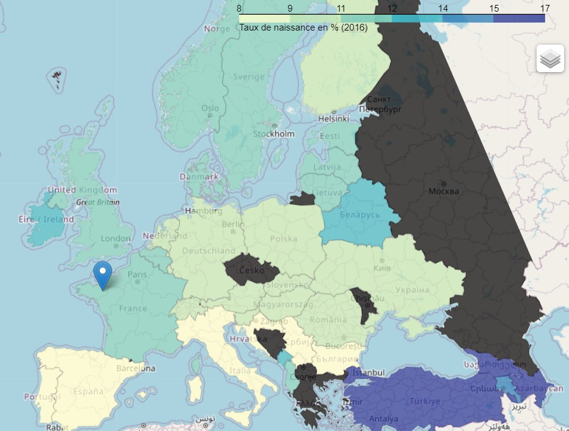

# European demography from 2010 to today

### Project goal: 
Answer the question: __"How has the demography of European countries evolved from 2010 to today and what are the potential explanatory factors ?"__ using Python.

### Libraries used:
pandas, numpy, matplotlib, scipy, seaborn, folium, wordcloud, googletrans, bs4 (BeautifulSoup), os, random, PIL, IPython.display.

### Files / Folders:

- __Rapport_demographie_europe_python.pdf__ : submitted project report
- __data_final__ : folder of the final data sets used
- __Europe_demographie_analyse.ipynb__ : Jupyter Notebook of my main code analyzing the data sets
- __Data_Agregation.py__ : program used for creating the data sets
- __Scraping_data.py__  : scraping program used for creating the data sets
- __data_scrap & data_eurostat__ : folders of files used during the creation of my data sets

- __images_anim__ : folder of images used in my Analyse_&_Visualisation.ipynb code
- __scatterplot_anim.gif__ : GIF created and used by my Analyse_&_Visualisation.ipynb code
- __ellipse.png__ : image used in my Analyse_&_Visualisation.ipynb code
- __carte_taux_naissance_2016.jpg__ : image used in my README.md
